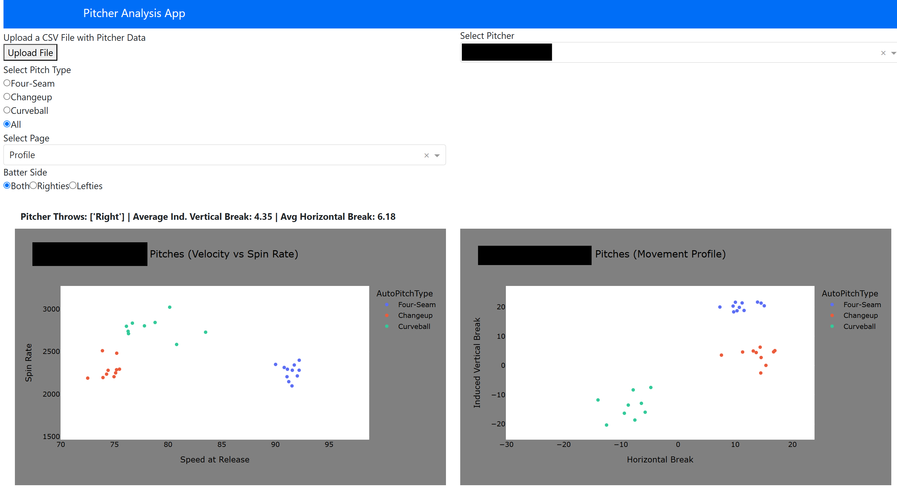

*Shared work with Ethan Sax, Auburn University*

## Project Goals

This year I was given the opportunity by a friend and colleague of mine to join a project working with the baseball team at Auburn University, specifically working with the pitching staff. The main goals for this project were to develop a way to evaluate pitchers from other college teams, especially teams outside of the SEC, to understand if/how their "stuff"  will translate to SEC play, and to develop a way to motivate pitcher improvement plans, and to statistically understand which aspects of a pitch make it more or less effective than others. This sort of framework is not a new idea in baseball, but if properly implemented, can be invaluable when it come to team performance. If a program like Auburn, who ranked very poorly in the SEC in the 2023-2024 season in terms of pitching, can pick up some good pitchers from the transfer portal and fine-tune the guys on the squad already, the team will be one step closer to the success seen in recent years. 

## Project Methods

At this stage in the project, the team has focused on generating a Stuff+ metric. Though Stuff+ takes on several definitions and nuances, our Stuff+ metric quantifies a pitcher's ability to produce a swing and a miss on any given pitch. Using some predictive modeling, we can quantify a specific pitch's % chance for a whiff, and compare it to the league average chance for a whiff. This definition has seen use in the past, the team encountered it first from Kai Franke's article found [here](https://medium.com/@kaifranke3/building-a-stuff-model-using-xgboost-8c548fbab8f2), a source of inspiration for some of out methods. There are other definitions for "stuff", and these metrics will be explored at a later date, but this blog focuses solely on a pitcher's ability to get whiffs.

The data used for this project is the main difference between our results and the results shown in most other article. As stated in the first paragraph, the main motivation lies in understanding how a pitcher will translate to SEC play. To this end, the data considered involves only SEC pitchers. Specifically, the team was provided with the Trackman pitch data from SEC games in the 2020 to 2024 seasons. The data was filtered down to only contain pitch characteristics, such as spin rate, velocity, etc. (All variables with descriptions can be found [here](https://support.trackmanbaseball.com/hc/en-us/articles/5089413493787-V3-FAQs-Radar-Measurement-Glossary-Of-Terms)). From this data, several features were engineered, including the differences in speed, spin, and movement from the pitcher's primary fastball. It was also important for us to understand how a guy's specific pitch matched up against that specific pitch in the SEC. To this end, models were built for individual pitches:  
- Four Seams
- Cutters
- Sinkers (includes two-seams)
- Changeups
- Splitters
- Curveballs
- Sliders

Any other pitches (e.g. Knuckleballs) were removed from the data set before training, as their sample sizes were too low. 

### Models

Up to this point, the main results that will be presented were generated using the XGBoost Classifier in Python. The hyperparameters were selected using Bayesian Hyperparameter Tuning, a method that attempts to build a function from the parameter space of the XGBoost model to model performance. Specifically, the models were trained to achieve the best F1 score, the harmonic mean of precision and recall. Maximizing this performance on the training set seemed to have the best overall performance in the validation sets across the board. The data was split 70-30 into training and evaluation sets. 

This data set is imbalanced by nature, only about 10% of the pitches resulting in whiffs. Early iterations of the models performed very poorly due to this, even after tuning XGBoost, a classifier that normally works well on its own on imbalanced data. To further mitigate the imbalanced nature, synthetic minority oversampling (SMOTE) was used to generate more minorty class points (in this case, whiffs) in the training set. No synthetic points were added to the evaluation set. This method produced the best results in terms of classificaiton metrics, and the presented results stem from this methodology.

## Stuff+ Characteristics

As described earlier, Stuff+ measures how well a pitcher induces whiffs compared to the average pitcher. This statistic is scaled to a distribution with a mean of 100 and a standard deviation of 10 for interpretability. The statistic is measured for each pitch thrown, and the average is reported for each player. This results in normality as the number of pitches increases which leads to the desired interpretation: a Stuff+ of 100 is league average, a Stuff+ of 110 (one SD above the mean) represents a pitch that is as good or better than about 84% of all pitches of that type, where a Stuff+ of 90 (one SD below the mean) represents a pitch that is only as good or better than about 16% of the pitches of that type.     

## Project Applications

With the trained models, we could move into the applications of the project. I created a web application for the team's use where a coach or player could upload a trackman .csv file from a game or a bullpen session and immediately get feeback on pitch tendencies (location, speed vs. spin, movement profile), subsetable by pitch type and batter handedness. On top of this, pitcher Stuff+ is shown via two heatmaps: one indicating pitch spin vs. speed and the other showing pitch movement profile, and how these compare to other pitches of the same type. The graph is colored by average stuff+, and the white cross indicates where the selected pitcher falls in the distribution. This can give the pitching staff insight on what characteristics of the pitch need to change to improve general effectiveness. In the following examples, names are blacked out for confidentiality.

This web addresses the two main goals at the same time. We can take .csv files from pitchers in other conferences, high school, etc, throw it into the app and see how it stacks up compared to pitchers currently in the SEC. A guy who averages 12K/9 in the Big 10 is obviously very successful up there, but the app may indicate that he is just average in comparison to SEC pitchers. 

## Personal Experience with Project

This project has been an amazing learning experience personally. As a stats/data science graduate student, I have spent a lot of time with machine learning prediction and things like that, so model building came fairly easily for this project. The best experiences came from the communications required with the Auburn baseball team and what that entails, as well as the web app builiding and hosting process.
