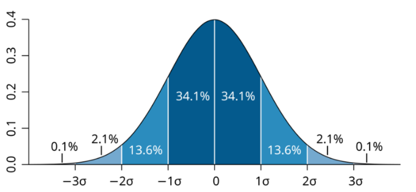
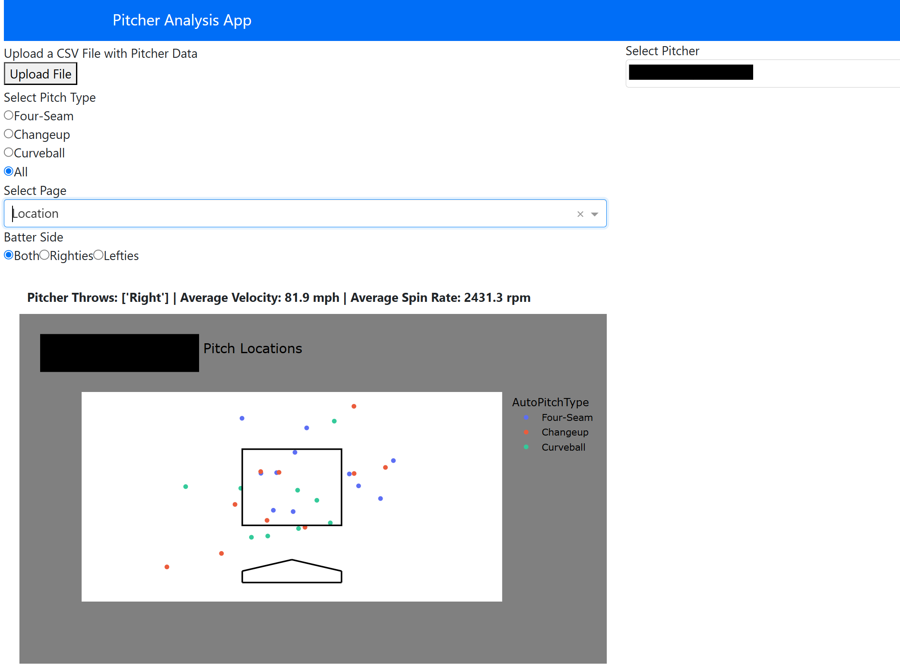
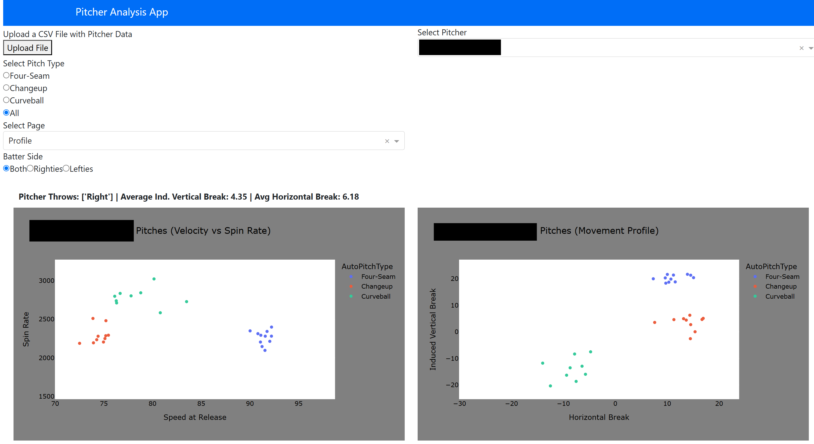
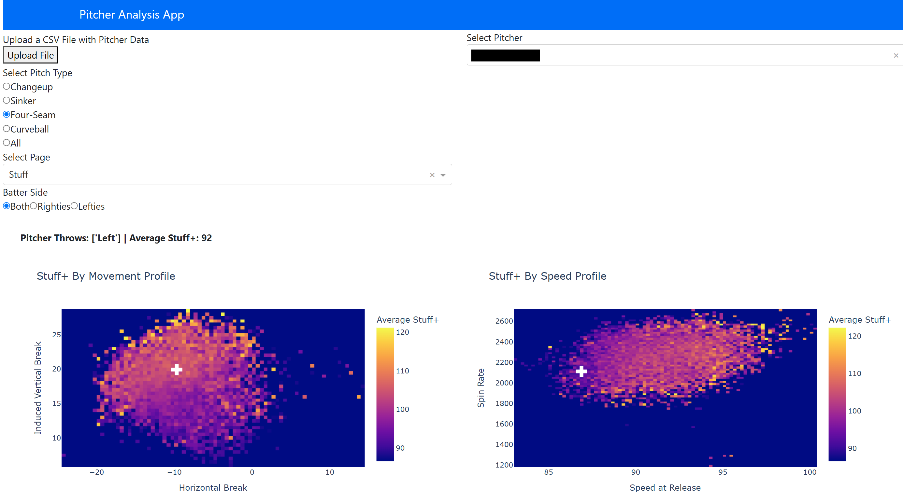

layout: post
title: 
subtitle: Predictive Modeling for advanced Pitcher Metrics  
cover-img: ../assets/img/stuff_header.png 
thumbnail-img: ../chase.jpeg
share-img:
tags: Sports-Analytics, Baseball, Pitching, Machine-Learning
author: Charles Benfer
---

*Shared work with Ethan Sax, Auburn University*

*No actual player statistics are provided here due to the privacy of the data set*

## Project Goals

In Fall 2024, I was given the opportunity by a friend and colleague to work with the Auburn University Baseball Team pitching staff. The main goals for this project were to develop an evaluation tool for pitchers from other college teams outside of the SEC to understand how their "stuff" would translate to SEC play, and to motivate pitcher improvement plans, statistically understanding which aspects of a pitch make it more or less effective than others. This sort of framework is not a new idea in baseball, and when properly implemented, can be invaluable when it come to team performance. If a program like Auburn, who ranked very poorly in the SEC in the 2023-2024 season in terms of pitching, can pick up some good pitchers from the transfer portal and fine-tune the guys on the squad already, the team will be one step closer to the success seen in recent years. 

## Project Methods

At this stage in the project, the team focused on generating a Stuff+ metric. Though Stuff+ takes on several definitions and nuances, our Stuff+ metric quantifies a pitcher's ability to produce a swing and a miss on any given pitch. Using some predictive modeling, we can quantify a single pitch's percent chance to produce a whiff, and compare it to the league average chance for a whiff. This definition has seen use in the past, the team encountered it first from Kai Franke's article found [here](https://medium.com/@kaifranke3/building-a-stuff-model-using-xgboost-8c548fbab8f2), a source of inspiration for some of our methods.

The data used for this project is the main difference between our results and the results shown in most other publically available articles or repositories. As stated in the first paragraph, the main motivation lies in understanding how a pitcher will translate to SEC play. To this end, the training data considered involves only SEC pitchers. Specifically, the team was provided with the Trackman pitch data from SEC games in the 2020 to 2024 seasons. The data was filtered down to only contain pitch characteristics, such as spin rate, velocity, etc. (All variables with descriptions can be found [here](https://support.trackmanbaseball.com/hc/en-us/articles/5089413493787-V3-FAQs-Radar-Measurement-Glossary-Of-Terms)). From this data, several features were engineered, including the differences in speed, spin, and movement from the pitcher's primary fastball. This statistic is location-invariant, meaning where the pitch crosses the plate is not included as a feature in the models. 
Different types of pitches enduce whiffs in different ways, so to account for this, models were built for individual pitches:  
- Four Seams
- Cutters
- Sinkers (includes two-seams)
- Changeups
- Splitters
- Curveballs
- Sliders

Any other pitches (e.g. Knuckleballs) were removed from the data set before training, as their sample sizes were too low. 

### Models

The team selected the XGBoost classifier for its quick training and proven performance with complex relationships. The hyperparameters were selected using Bayesian Hyperparameter Tuning, a method that attempts to build a function from the parameter space of the XGBoost model to model performance. Specifically, the models were trained to achieve the best F1 score, the harmonic mean of precision and recall. Maximizing this performance on the training set seemed to have the best overall performance in the validation sets across the board. The data was split 70-30 into training and evaluation sets. 

This data set is imbalanced by nature, with only about 10% of the pitches resulting in whiffs. Early iterations of the models performed very poorly on unseen data due to this, even after tuning XGBoost, a classifier that normally handles imbalanced data. To further mitigate issues from the imbalanced nature, synthetic minority oversampling (SMOTE) was used to generate more minorty class points (in this case, whiffs) in the training set. No synthetic points were added to the evaluation set. This method produced the best results in terms of classificaiton metrics on unseen data, and the presented results stem from this methodology.

## Stuff+ Characteristics

As described earlier, Stuff+ measures how well a pitcher induces whiffs compared to the average pitcher. This statistic is scaled to a distribution with a mean of 100 and a standard deviation of 10 for interpretability. The statistic is measured for each pitch thrown, and the average is reported for each player. This results in normality in pitcher averages as the number of pitches increases which leads to the desired interpretation: a Stuff+ of 100 is league average, a Stuff+ of 110 (one SD above the mean) represents a pitcher that is as good or better at missing bats than about 84% of all pitchers for that specific pitch type, where a Stuff+ of 90 (one SD below the mean) represents a pitcher that is only as good or better than about 16% of the pitchers for that specific pitch type at missing bats.     

## Project Applications

With the trained models, we could move into the applications of the project. I created a web application for the team's use where a coach or player could upload a Trackman .csv file from a game or a bullpen session and immediately get feeback on pitch tendencies (location, speed vs. spin, movement profile), subsetable by pitch type and batter handedness. On top of this, pitcher Stuff+ is shown via two heatmaps: one indicating pitch spin vs. speed and the other showing pitch movement profile, and how these compare to other pitches of the same type. This is also a feature we pulled from Franke's article mentioned earlier, and felt it perfectly fit our needs. The graph is colored by average stuff+, and the white cross indicates where the selected pitcher falls in the distribution. This can give the pitching staff insight on what characteristics of the pitch need to change to improve general effectiveness. Here, we see examples of each page of the web app. Names are blacked out for confidentiality.

*We can see here that this pitcher's four-seam could use more ride (left hand side) and more velocity (right hand side). Not necessarily revolutionary...*

This app addresses the two main goals at the same time. We can take .csv files from pitchers in other conferences, high school, etc, throw it into the app and see how it stacks up compared to pitchers from the SEC. A guy who averages 12 K/9 in the Big 10 is very successful up there, but the app may indicate that he is just average in comparison to SEC pitchers. At the same time, after a practice, intersquad matchup, or full game, the Trackman data can be analyzed immediately to see how a guy's stuff looked for that subset of pitches. This can be used as an additional point in favor or against changes being made to the pitcher's arsenal.  

All in all, the app, models, and pretty much everything else in this project are in their early stages. As we get more opportunities to use the app, we will understand which features need to be included and which ones can be dropped. We will also be adding other statistics created with predictive modeling: whiffs are but one of many binary outcomes that occur during a baseball game. The next item on the docket is to create a run value metric for each pitch. This is taking a bit of data manipulation and hand waving due to the nature of the Trackman data, but I am sure this will be completed by the end of February.  

## Personal Experience with Project

This project has been an amazing learning experience personally. As a Statistics and Data Science graduate student, I have spent a lot of time with machine learning, prediction and things like that, so the model building, selection, and evaluation were not vastly different from previous projects. The best lessons I learned involved the collaboration with the Auburn Baseball team and the creation of the web app.

To this point in my academic career, most of my major data science projects were coursework. When working on a project for a class, there are periodic check-ins with the professsor, almost unlimited aid from a person who knows exactly what the final product should look like, and often structured deadlines to motivate progress. With a project like this, it was essential to problem solve every step of the way while using all of the knowledge from previous course work and projects to assess and determine future directions. This is an invaluable skill, and a muscle I was able to work extensively for the few months we have been working on this project. 

This was also the first time I designed an active site and hosted it publically. While it took some getting used to, and certainly is not something I would call myself great at *yet*, designing the front end for the app, combining that with the backend, and hosting it so the baseball team could access it without needing to launch a text editor or IDE is now another tool in the toolbelt. I had built simple Shiny apps with R for courses in the past that were never made publically available, but this app was created using Dash in Python and hosted on Render. I now have the skill set to build apps of this nature for all types of data, and plan to test out my chops on major league data in passion projects in the near future. 
subtitle: Predictive Modeling for advanced Pitcher Metrics  
cover-img: ../assets/img/stuff_header.png 
thumbnail-img: ../chase.jpeg
share-img:
tags: Sports-Analytics, Baseball, Pitching, Machine-Learning
author: Charles Benfer
---

*Shared work with Ethan Sax, Auburn University*

*No actual player statistics are provided here due to the privacy of the data set*

## Project Goals

In Fall 2024, I was given the opportunity by a friend and colleague to work with the Auburn University Baseball Team pitching staff. The main goals for this project were to develop an evaluation tool for pitchers from other college teams outside of the SEC to understand how their "stuff" would translate to SEC play, and to motivate pitcher improvement plans, statistically understanding which aspects of a pitch make it more or less effective than others. This sort of framework is not a new idea in baseball, and when properly implemented, can be invaluable when it come to team performance. If a program like Auburn, who ranked very poorly in the SEC in the 2023-2024 season in terms of pitching, can pick up some good pitchers from the transfer portal and fine-tune the guys on the squad already, the team will be one step closer to the success seen in recent years. 

## Project Methods

At this stage in the project, the team focused on generating a Stuff+ metric. Though Stuff+ takes on several definitions and nuances, our Stuff+ metric quantifies a pitcher's ability to produce a swing and a miss on any given pitch. Using some predictive modeling, we can quantify a single pitch's percent chance to produce a whiff, and compare it to the league average chance for a whiff. This definition has seen use in the past, the team encountered it first from Kai Franke's article found [here](https://medium.com/@kaifranke3/building-a-stuff-model-using-xgboost-8c548fbab8f2), a source of inspiration for some of our methods.

The data used for this project is the main difference between our results and the results shown in most other publically available articles or repositories. As stated in the first paragraph, the main motivation lies in understanding how a pitcher will translate to SEC play. To this end, the training data considered involves only SEC pitchers. Specifically, the team was provided with the Trackman pitch data from SEC games in the 2020 to 2024 seasons. The data was filtered down to only contain pitch characteristics, such as spin rate, velocity, etc. (All variables with descriptions can be found [here](https://support.trackmanbaseball.com/hc/en-us/articles/5089413493787-V3-FAQs-Radar-Measurement-Glossary-Of-Terms)). From this data, several features were engineered, including the differences in speed, spin, and movement from the pitcher's primary fastball. This statistic is location-invariant, meaning where the pitch crosses the plate is not included as a feature in the models. 
Different types of pitches enduce whiffs in different ways, so to account for this, models were built for individual pitches:  
- Four Seams
- Cutters
- Sinkers (includes two-seams)
- Changeups
- Splitters
- Curveballs
- Sliders

Any other pitches (e.g. Knuckleballs) were removed from the data set before training, as their sample sizes were too low. 

### Models

The team selected the XGBoost classifier for its quick training and proven performance with complex relationships. The hyperparameters were selected using Bayesian Hyperparameter Tuning, a method that attempts to build a function from the parameter space of the XGBoost model to model performance. Specifically, the models were trained to achieve the best F1 score, the harmonic mean of precision and recall. Maximizing this performance on the training set seemed to have the best overall performance in the validation sets across the board. The data was split 70-30 into training and evaluation sets. 

This data set is imbalanced by nature, with only about 10% of the pitches resulting in whiffs. Early iterations of the models performed very poorly on unseen data due to this, even after tuning XGBoost, a classifier that normally handles imbalanced data. To further mitigate issues from the imbalanced nature, synthetic minority oversampling (SMOTE) was used to generate more minorty class points (in this case, whiffs) in the training set. No synthetic points were added to the evaluation set. This method produced the best results in terms of classificaiton metrics on unseen data, and the presented results stem from this methodology.

## Stuff+ Characteristics

As described earlier, Stuff+ measures how well a pitcher induces whiffs compared to the average pitcher. This statistic is scaled to a distribution with a mean of 100 and a standard deviation of 10 for interpretability. The statistic is measured for each pitch thrown, and the average is reported for each player. This results in normality in pitcher averages as the number of pitches increases which leads to the desired interpretation: a Stuff+ of 100 is league average, a Stuff+ of 110 (one SD above the mean) represents a pitcher that is as good or better at missing bats than about 84% of all pitchers for that specific pitch type, where a Stuff+ of 90 (one SD below the mean) represents a pitcher that is only as good or better than about 16% of the pitchers for that specific pitch type at missing bats.     

## Project Applications

With the trained models, we could move into the applications of the project. I created a web application for the team's use where a coach or player could upload a Trackman .csv file from a game or a bullpen session and immediately get feeback on pitch tendencies (location, speed vs. spin, movement profile), subsetable by pitch type and batter handedness. On top of this, pitcher Stuff+ is shown via two heatmaps: one indicating pitch spin vs. speed and the other showing pitch movement profile, and how these compare to other pitches of the same type. This is also a feature we pulled from Franke's article mentioned earlier, and felt it perfectly fit our needs. The graph is colored by average stuff+, and the white cross indicates where the selected pitcher falls in the distribution. This can give the pitching staff insight on what characteristics of the pitch need to change to improve general effectiveness. Here, we see examples of each page of the web app. Names are blacked out for confidentiality.

*We can see here that this pitcher's four-seam could use more ride (left hand side) and more velocity (right hand side). Not necessarily revolutionary...*

This app addresses the two main goals at the same time. We can take .csv files from pitchers in other conferences, high school, etc, throw it into the app and see how it stacks up compared to pitchers from the SEC. A guy who averages 12 K/9 in the Big 10 is very successful up there, but the app may indicate that he is just average in comparison to SEC pitchers. At the same time, after a practice, intersquad matchup, or full game, the Trackman data can be analyzed immediately to see how a guy's stuff looked for that subset of pitches. This can be used as an additional point in favor or against changes being made to the pitcher's arsenal.  

All in all, the app, models, and pretty much everything else in this project are in their early stages. As we get more opportunities to use the app, we will understand which features need to be included and which ones can be dropped. We will also be adding other statistics created with predictive modeling: whiffs are but one of many binary outcomes that occur during a baseball game. The next item on the docket is to create a run value metric for each pitch. This is taking a bit of data manipulation and hand waving due to the nature of the Trackman data, but I am sure this will be completed by the end of February.  

## Personal Experience with Project

This project has been an amazing learning experience personally. As a Statistics and Data Science graduate student, I have spent a lot of time with machine learning, prediction and things like that, so the model building, selection, and evaluation were not vastly different from previous projects. The best lessons I learned involved the collaboration with the Auburn Baseball team and the creation of the web app.

To this point in my academic career, most of my major data science projects were coursework. When working on a project for a class, there are periodic check-ins with the professsor, almost unlimited aid from a person who knows exactly what the final product should look like, and often structured deadlines to motivate progress. With a project like this, it was essential to problem solve every step of the way while using all of the knowledge from previous course work and projects to assess and determine future directions. This is an invaluable skill, and a muscle I was able to work extensively for the few months we have been working on this project. 

This was also the first time I designed an active site and hosted it publically. While it took some getting used to, and certainly is not something I would call myself great at *yet*, designing the front end for the app, combining that with the backend, and hosting it so the baseball team could access it without needing to launch a text editor or IDE is now another tool in the toolbelt. I had built simple Shiny apps with R for courses in the past that were never made publically available, but this app was created using Dash in Python and hosted on Render. I now have the skill set to build apps of this nature for all types of data, and plan to test out my chops on major league data in passion projects in the near future. 
