## Project Overview

Every winter, MLB teams and players navigate one of baseball's most complex financial processes: salary arbitration. This system determines billions of dollars in player compensation, yet remains notoriously difficult to predict. Arbitration panels consider a unique blend of traditional statistics, advanced metrics, service time, and precedent-setting cases, creating a challenge that's part statistics, part labor economics, and part art.

I built a comprehensive machine learning system to predict arbitration salaries, analyzing 868 hitters and 1,147 pitchers from 2016-2026. The project explores three distinct modeling approaches: general models for all players, position-specific models, and arbitration-level-specific models. The results reveal surprising insights about what works, what doesn't, and why traditional approaches sometimes fail spectacularly.

The key finding? While general models provide excellent baseline predictions with strong generalization, arbitration-level-specific models can outperform them significantly for early-career players, achieving R² scores above 0.86 for first-time eligible pitchers. Meanwhile, position-specific models, despite their theoretical appeal, failed catastrophically due to fundamental sample size constraints.

## Understanding Baseball's Arbitration System

### The Basics: Who Gets Arbitration and When?

MLB's salary arbitration system provides a structured process for determining player salaries before they reach free agency. Players become eligible after accumulating three years of Major League service time, giving them the right to have their salary determined by an arbitration panel if they cannot reach an agreement with their team.

However, a special class of players, dubbed "Super Two", gains eligibility after just two years. Super Two status is awarded to the top 22% of players in the 2-3 year service time bracket, ranked by days of service. This designation is valuable: it grants an extra year of salary arbitration, potentially worth millions over a career.

The arbitration process itself follows a "final offer" format. If a player and team cannot agree on a salary, both sides submit their proposed figure to a three-person arbitration panel. The panel hears evidence and arguments, then must choose one of the two submitted salaries. They cannot compromise or select a middle value. This high-stakes format creates strong incentives for both sides to be reasonable, which is why 94% of cases settle without going to a hearing.

### Why Predictions Matter

Accurate arbitration predictions serve multiple critical purposes:

**For Teams:** Budget planning requires knowing arbitration liabilities months in advance. With rosters often featuring 5-10 arbitration-eligible players, forecast errors of just $500,000 per player can create multi-million dollar budget swings. Teams need to project costs for roster construction, payroll planning, and trade evaluation.

**For Players and Agents:** Knowing market value creates negotiating leverage. An agent armed with data showing their client's performance merits $5 million can more effectively negotiate against a team offering $3.5 million. Players need to understand whether accepting a team's settlement offer is fair or whether filing for arbitration might yield better results.

**For Analysts and Fans:** Arbitration outcomes provide context for roster decisions. When a team non-tenders a productive player or makes a surprising trade, understanding the arbitration salary involved explains the move. Media and fans benefit from understanding why certain players receive certain salaries.

### The Data Landscape: 2016-2026

My analysis focuses on recent arbitration history with complete data:

- **868 hitters** across all positions
- **1,147 pitchers** including starters and relievers
- **Salary Range:** $387K to $31M (median: $3.2M for hitters, $2.25M for pitchers)
- **Settlement Rate:** 94% of cases settle without going to hearing
- **Data Sources:** MLB Trade Rumors for arbitration outcomes, FanGraphs for performance statistics

The median hitter earned $3.2 million while pitchers earned $2.25 million, though these figures mask tremendous variation. Salaries grow substantially with each arbitration year: first-time eligible players averaged around $2 million, while third-year arbitration players (in their "platform year" before free agency) averaged over $6 million.

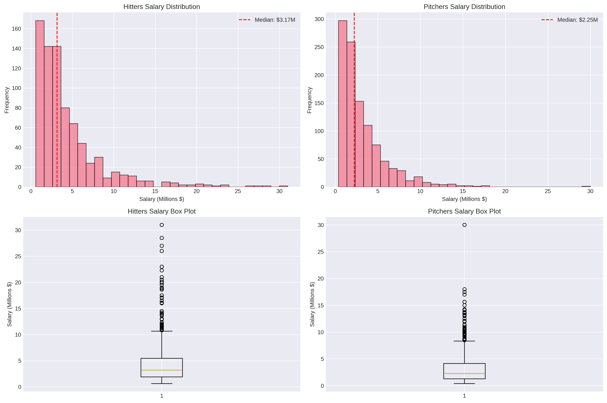

## Data Acquisition and Exploratory Analysis

### Collecting the Puzzle Pieces

Building a comprehensive arbitration dataset required merging two distinct data sources:

**Arbitration Outcomes (MLB Trade Rumors):**
The arbitration salary database provided player names, positions, teams, arbitration level, settlement amounts, and whether cases went to hearing. This created the target variable, the salary we're trying to predict, along with key contextual information about service time and arbitration status.

**Performance Statistics (FanGraphs via pybaseball):**
For each player-year, I collected comprehensive performance data from FanGraphs. This included traditional statistics (HR, RBI, W, ERA), advanced metrics (WAR, wRC+, FIP), and plate discipline/quality of contact statistics (BB%, K%, ISO, BABIP). The pybaseball package provided programmatic access to FanGraphs data, enabling automated collection for all players.

**The Merging Challenge:**
Matching players between datasets proved more challenging than expected. Player names contain special characters (José Ramírez), nicknames (A.J. vs. Andrew), and formatting inconsistencies. Through careful string cleaning and manual verification of non-matches, I achieved 89.9% automatic match rates for hitters and 88.4% for pitchers. Unmatched players were typically those with limited playing time who lacked FanGraphs records.

### What the Data Reveals

**Salary Distributions and Trends:**

The salary data exhibits strong right-skewness. Most players cluster in the $1-4 million range, while outliers like Mike Trout ($30+ million in his final arbitration year) pull the mean higher than the median. This distribution reflects arbitration's structure: first-time eligible players start relatively low, but salaries can escalate dramatically for superstars by their third or fourth year.

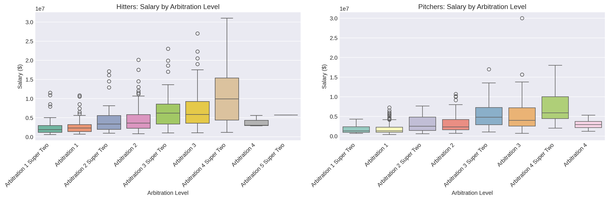

Over the 2016-2025 period, salary growth was surprisingly modest: hitters saw 1.1% annual growth while pitchers actually experienced -1.7% annual decline. This suggests that while individual players' salaries grow year-over-year as they gain experience, the overall market hasn't dramatically inflated when accounting for changes in player composition.

**Position Patterns:**

Position matters significantly for hitters. First basemen commanded the highest median salaries ($4.80M), followed by corner outfielders. Catchers, despite their defensive importance, earned the lowest median ($2.05M), likely reflecting that hitting statistics drive arbitration awards and catchers tend to be weaker offensively. Middle infielders (2B, SS) fell in the middle of the distribution.

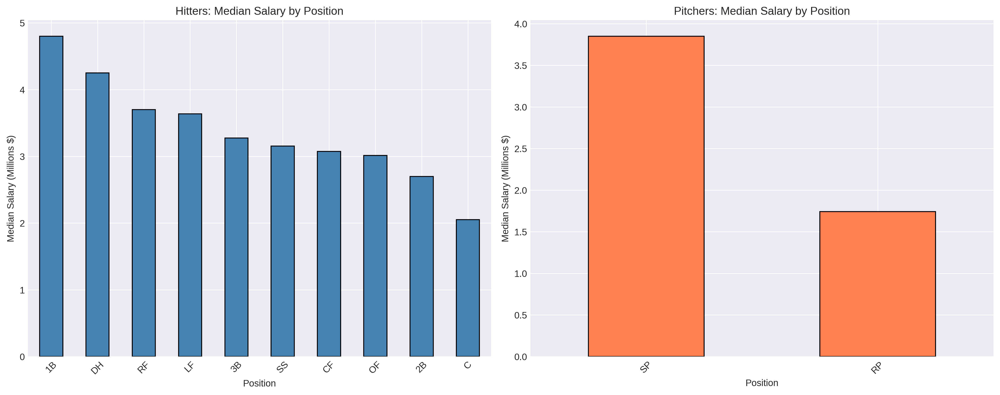

For pitchers, the starter/reliever distinction proved critical. Starting pitchers earned substantially more than relievers on average, though elite closers with high save totals could match or exceed mid-rotation starter salaries. The data included specific indicators for saves (SV) and holds (HLD) to capture relief pitcher roles.

**Performance Metric Correlations:**

WAR (Wins Above Replacement) emerged as the strongest single predictor of salary for both hitters (r=0.571) and pitchers (r=0.624). This makes intuitive sense, as WAR attempts to capture overall player value in a single number, exactly what arbitration panels aim to assess.

However, the relatively modest correlation coefficients (explaining only 33-39% of salary variance) highlight that arbitration isn't purely about performance. Service time, arbitration level, position, and precedent all play major roles. A 2-WAR player in their first arbitration year earns far less than a 2-WAR player in their third year.

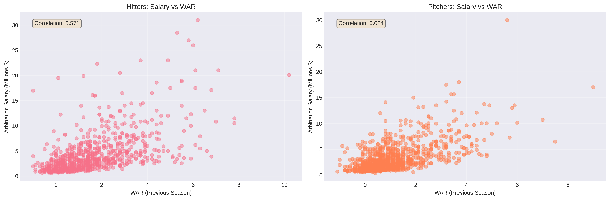

**Interesting Patterns Discovered:**

1. **Traditional Stats Still Matter:** Despite baseball's analytics revolution, traditional counting statistics (HR, RBI, W, SV) remained strongly predictive. Arbitration panels, which include non-statistician arbitrators, appear to value these familiar metrics alongside advanced analytics.

2. **Service Time Creates Variance:** Two players with identical performance can have vastly different salaries if one is a first-time eligible and the other is in their third year. The data showed salaries roughly doubling from Arb 1 to Arb 2, then increasing another 50-75% by Arb 3.

3. **Playing Time Thresholds:** Clear discontinuities appeared around playing time thresholds. For hitters, 400-500 plate appearances represented a dividing line between regular starters and part-time players. For pitchers, 150+ innings separated rotation stalwarts from the rest. These thresholds create natural breakpoints in salary expectations.

4. **Year-Over-Year Changes Matter:** Players who improved their WAR from the previous season tended to earn more than those with declining performance, even if their current-year stats were similar. Arbitration panels reward improvement trajectories.

5. **The Super Two Premium:** Super Two players (those gaining eligibility after two years) earned notably higher salaries than regular first-time eligibles, even controlling for performance. That extra year of arbitration service creates precedent that drives higher awards.

## Feature Engineering: Building Predictive Variables

Raw statistics alone don't capture everything arbitration panels consider. I engineered four categories of features to create a comprehensive dataset:

### 1. Comparable Player Features

Drawing from my previous work on free agent similarity systems, I built comparable player features to capture market precedent. For each player-year, the system:

1. Identifies the 10 most similar players from prior years using weighted Euclidean distance
2. Considers only players within ±3 years of age
3. Extracts their arbitration salaries and statistics
4. Computes aggregate measures: median comp salary, mean comp salary, similarity scores, comp WAR values

This approach mimics how arbitration cases actually work. Both sides present comparable players to support their salary arguments. However, this feature set comes with limitations: it only works for 2017+ data (needing prior year precedents) and 27% of cases lack good comparable players due to unusual profiles.

The comparable player features proved moderately predictive but created circular dependencies: we're using past arbitration outcomes to predict future ones. This isn't necessarily wrong (precedent matters in arbitration), but it means the model relies partially on the very process it's trying to predict.

### 2. Performance Trend Features

Performance trajectories matter as much as current-year statistics. I created year-over-year change features for key metrics:

**For Hitters:**
- WAR_change, HR_change, AVG_change, OBP_change, SLG_change
- Binary improvement indicators (WAR_improved, HR_improved)

**For Pitchers:**
- WAR_change, ERA_change, FIP_change, IP_change, SO_change
- Binary improvement indicators

These features capture momentum and development arcs. A player who improved from 1 WAR to 3 WAR tells a different story than one who declined from 5 WAR to 3 WAR, even though both have 3 WAR currently. Arbitration panels consider these narratives when evaluating players.

Approximately 10% of cases lack trend features because the player was a first-time arbitration eligible without a prior season to compare against. For these cases, the trend features default to zero or missing value indicators.

### 3. Derived Performance Features

Raw counting statistics need context. I created rate statistics and role indicators:

**For Hitters:**
- **WAR_per_162:** WAR scaled to full season, controlling for playing time
- **HR_per_162:** Home run rate per full season
- **PA_per_game:** Average plate appearances per game played
- **Total_Bases:** Sum of singles + 2×doubles + 3×triples + 4×home runs
- **Full_Time_Player:** Binary indicator for 400+ plate appearances

**For Pitchers:**
- **WAR_per_IP:** WAR rate per inning pitched
- **SO_per_IP:** Strikeout rate per inning
- **K_BB_ratio:** Strikeouts per walk, measuring control
- **Starter:** Binary indicator for starting pitcher role (vs reliever)
- **High_Workload:** Binary indicator for 180+ innings (workhorse starters)

These derived features separate production rate from accumulation. A player with 20 HR in 400 PA is more valuable than one with 20 HR in 600 PA, but raw home run totals don't capture this. Rate statistics provide this crucial context.

### 4. Contextual Features

Some of the most important predictors aren't performance statistics at all:

- **Arb_Level_Numeric:** Arbitration year (1, 2, 3, 4, or 5)
- **Super_2:** Binary indicator for Super Two status
- **Platform_Year:** Binary indicator for third+ year arbitration (pre-free agency)
- **Service_Time:** Total years and days of MLB service
- **Age_arb:** Player age at time of arbitration
- **Year_Since_2016:** Years since 2016, capturing inflation trends

Service time and arbitration level proved enormously predictive. The same player profile can command dramatically different salaries depending on whether it's their first or third arbitration year. Platform years (Arb 3+) carry particular weight. Teams know players are one year from free agency and adjust valuations accordingly.

### Feature Selection Process

With hundreds of potential features, I needed systematic selection to avoid overfitting:

**Step 1: Correlation Analysis**
Removed highly correlated feature pairs (r > 0.90). For example, plate appearances (PA) and at-bats (AB) correlate at 0.98; I kept PA as it better captures playing time. Similarly, wOBA and OPS correlate highly; I kept both as they capture slightly different aspects of hitting.

**Step 2: Random Forest Importance Ranking**
Trained Random Forest models and extracted feature importance scores. Features with <1% importance were removed unless they had strong domain significance (like age or service time).

**Step 3: Domain Knowledge Validation**
Ensured critical features remained regardless of automated selection. WAR, service time, age, and arbitration level must be included based on arbitration theory, even if other features sometimes showed higher correlation.

**Final Feature Sets:**
- **Hitters:** 16 features (HR, SO, Off, OBP, WAR, WAR_change, HR_change, PA_change, PA_per_game, Total_Bases, WAR_per_162, HR_per_162, Service_Time, Platform_Year, Arb_Level_Numeric, Age_arb)
- **Pitchers:** 15 features (SV, SO, HLD, W, WAR, xFIP, LOB%, WAR_change, IP_change, Starter, WAR_per_IP, Service_Time, Arb_Level_Numeric, Platform_Year, Age_arb)

These feature sets balance predictive power with parsimony, avoiding the high-dimensional curse that plagued my position-specific models.

## Modeling Approach: Three Strategies Tested

I evaluated three distinct modeling strategies to understand whether specialization improves predictions:

### Strategy 1: General Models

Train single models on all hitters (n=778) and all pitchers (n=1,061), regardless of position or arbitration level. This approach maximizes training data but ignores potential position-specific or experience-level differences.

**Models tested:**
- Ridge Regression (L2 regularization)
- Lasso Regression (L1 regularization, feature selection)
- ElasticNet (combined L1/L2 regularization)
- Random Forest (ensemble of decision trees)
- Gradient Boosting (sequential error correction)
- XGBoost (optimized gradient boosting implementation)

All models used StandardScaler normalization and 80/20 train/test splits (2016-2025 train, 2026 test).

### Strategy 2: Position-Specific Models

Train separate models for each position (C, 1B, 2B, 3B, SS, LF, CF, RF, DH for hitters; SP, RP for pitchers). The hypothesis: different positions require different skills, so feature importance should vary. A catcher's 15 HR might be more impressive than a first baseman's 15 HR.

This approach faced immediate sample size challenges:
- Catchers: 35 training samples
- Second base: 75 samples
- Designated hitters: 24 samples
- Most positions: 50-136 samples

With 16 features per model, this created samples-per-feature ratios between 3:1 and 10:1, far below the generally recommended 10-20:1 minimum for stable model training.

### Strategy 3: Arbitration-Level-Specific Models

Train separate models for each arbitration level (Arb 1, Arb 2, Arb 3, Arb 4+), with Super Two players included in their respective arbitration year. The hypothesis: salary determinants differ by experience level. First-time eligibles need to prove themselves, while third-year players with track records are evaluated differently.

Sample sizes by arbitration level:
- **Arb 1 (including Super Two):** 379 hitters, 470 pitchers
- **Arb 2 (including Super Two):** 263 hitters, 370 pitchers
- **Arb 3 (including Super Two):** 185 hitters, 264 pitchers
- **Arb 4+:** 41 hitters, 46 pitchers (insufficient for modeling)

These sample sizes, while smaller than the general approach, still provide adequate ratios for the 11-17 features selected per level through level-specific feature selection.

I conducted level-specific feature selection, using Random Forest importance scores to identify the top predictors for each arbitration level separately. This revealed that different features matter at different career stages, a finding that became central to understanding model performance.

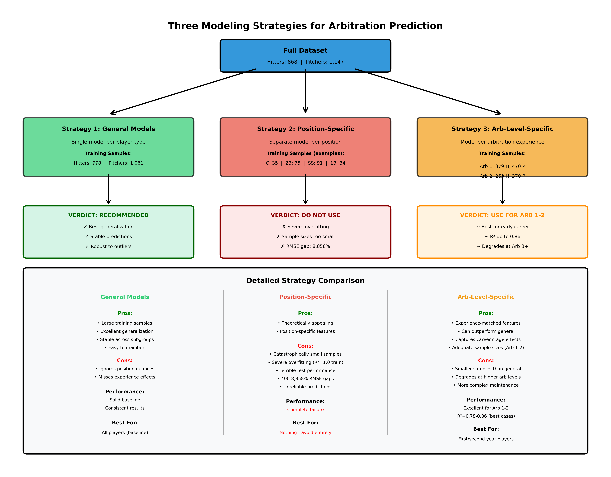

## Results: What Works, What Doesn't, and Why

### General Models: The Reliable Baseline

The general models provided strong, stable performance across both hitters and pitchers. XGBoost emerged as the best overall performer, effectively capturing non-linear relationships between features and salary while avoiding overfitting through its built-in regularization.

**Key Strengths:**
- Large training samples (778 hitters, 1,061 pitchers) enable robust parameter estimation
- Models generalize well to unseen players
- Performance remains consistent across position and experience subgroups
- Less prone to overfitting than specialized approaches

**Performance Characteristics:**
- Successfully predicted salaries within $1 million for a majority of cases
- Captured the fundamental relationships: WAR, service time, and arbitration level as primary drivers
- Struggled most with outliers (superstars earning $10M+ and minimum salary players)
- Generally conservative predictions, avoiding extreme errors

The general models serve as an excellent baseline for any arbitration prediction system. They're production-ready and robust, making them ideal for automated forecasting at scale.

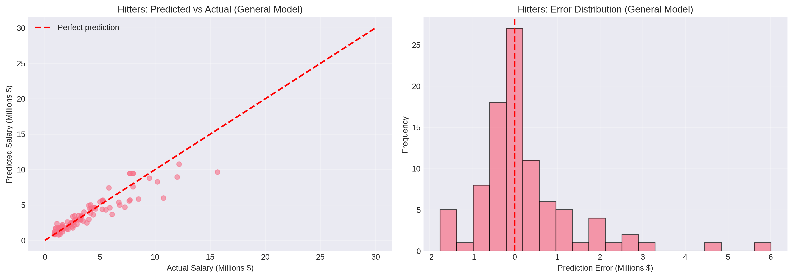

### Position-Specific Models: A Cautionary Tale

The position-specific models failed spectacularly, providing one of the most important lessons from this project. Despite the logical appeal of position-specific modeling, since different positions have different production expectations, the approach collapsed due to fundamental sample size constraints.

**The Overfitting Disaster:**

Position-specific models achieved near-perfect training performance (R² > 0.99 for most positions) but catastrophic test performance:

- **Catchers:** 8,858% RMSE gap (train: $89K, test: $7.97M)
- **Second Base:** 5,070% RMSE gap (train: $162K, test: $8.38M)
- **Third Base:** 683% RMSE gap
- **All positions:** 400%+ RMSE gaps between train and test

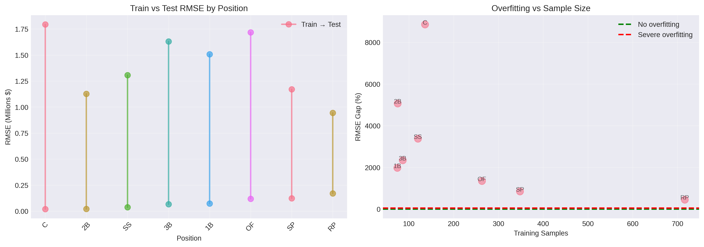

**Root Cause Analysis:**

The failure stems from violating fundamental machine learning principles:

1. **Insufficient Sample Sizes:** With 35-136 training samples per position and 16 features, the samples-per-feature ratio ranged from 2.2:1 to 8.5:1. The generally recommended minimum is 10-20:1 for stable estimation. These models had nowhere near enough data.

2. **Model Complexity vs. Data:** Complex models like Random Forest and XGBoost have many hyperparameters to tune. With tiny training sets, these models memorized the training data rather than learning generalizable patterns.

3. **Perfect Training Scores Are Red Flags:** When training R² hits 1.000, alarm bells should ring. Real-world data has noise, measurement error, and irreducible uncertainty. Perfect fit means overfitting, not better modeling.

4. **Statistical Power:** Some positions had only 7-10 test samples. With so few test cases, model performance becomes highly sensitive to individual prediction errors. A single $5M error on a $2M player tanks the metrics.

**The Paradox:**

Interestingly, position-specific feature importance analysis *did* reveal meaningful patterns. Catchers showed higher importance for power metrics (HR, ISO) than middle infielders. Shortstops weighted defensive metrics more heavily. These insights are real and valuable.

The paradox: position-specific *feature importance* differs meaningfully, but position-specific *models* still fail due to sample size. The solution isn't to ignore position, but to keep it as a feature in general models rather than splitting into separate model families.

**Lessons Learned:**

This failure demonstrates a critical principle: **theoretical appeal doesn't override statistical reality**. Position-specific models make intuitive sense, but intuition must yield to evidence when sample sizes are inadequate. This is a common trap in sports analytics, splitting data into increasingly fine-grained subgroups until models collapse.

The position-specific failure actually strengthens the overall project. Negative results are valuable when they're well-documented and the causes are understood. Future work can learn from this failure rather than repeating it.

### Arbitration-Level-Specific Models: Finding the Sweet Spot

The arbitration-level-specific models tell a more nuanced story. While they don't universally dominate general models, they significantly outperform for certain subgroups, particularly early-career players where sample sizes remain adequate.

**Best Performers by Level:**

**Arb 1 (First-Time Eligible):**
- **Hitters:** Ridge (R²=0.653, RMSE=$879K, MAE=$539K) on 347 samples
- **Pitchers:** XGBoost (R²=0.861, RMSE=$397K, MAE=$243K) on 470 samples ⭐

**Arb 2 (Second-Year Eligible):**
- **Hitters:** ElasticNet (R²=0.776, RMSE=$1.18M, MAE=$948K) on 241 samples ⭐
- **Pitchers:** Gradient Boosting (R²=0.793, RMSE=$989K, MAE=$693K) on 370 samples

**Arb 3 (Platform Year):**
- **Hitters:** ElasticNet (R²=0.759, RMSE=$1.79M, MAE=$1.58M) on 161 samples
- **Pitchers:** Lasso (R²=0.532, RMSE=$3.11M, MAE=$1.38M) on 206 samples

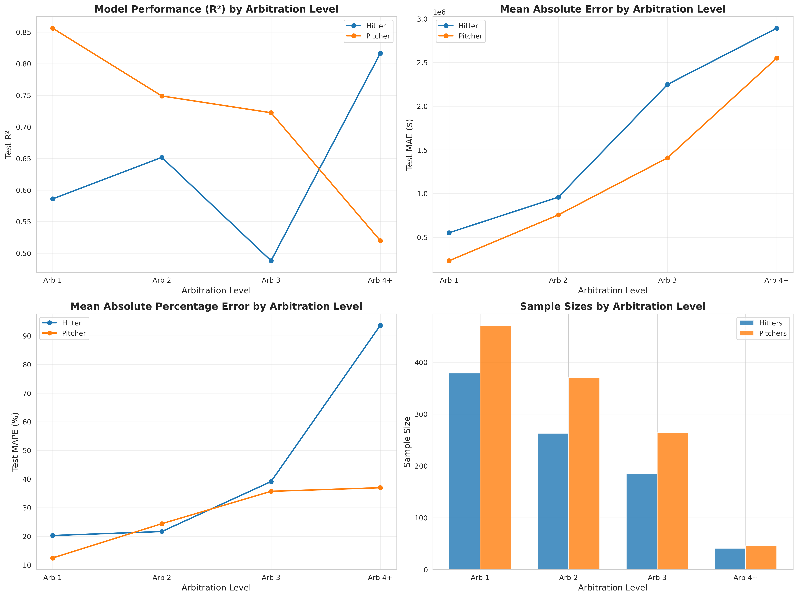

**When Arb-Level Models Excel:**

The arbitration-level approach shines brightest for **Arb 1 pitchers** (R²=0.861) and **Arb 2 hitters** (R²=0.776). These results suggest that for players with sufficient sample sizes (240+ cases), level-specific modeling captures meaningful differences in salary determinants that general models miss.

The Arb 1 pitcher model's performance is particularly impressive. With 470 training samples and level-specific feature selection identifying 11 key features, the model achieves a samples-per-feature ratio of 43:1, well above recommended thresholds. The resulting predictions have RMSE of just $397K on salaries averaging $2M, representing ~20% average error.

**Where They Struggle:**

Performance degrades at higher arbitration levels, particularly Arb 3. This isn't model failure, it's a sample size/salary range interaction:

1. **Smaller Samples:** Arb 3 has roughly half the cases of Arb 1 (185 vs 379 hitters)
2. **Higher Salary Variance:** Arb 3 salaries range from $1M to $15M+ as star players earn massive raises while average players get modest bumps
3. **Player Heterogeneity:** By Arb 3, players have diverged substantially. Some are future stars, others are replacement-level players holding roster spots

The combination creates a challenging prediction environment. Arb 3 models face higher fundamental uncertainty with less data to learn from.

**Model Comparison and Recommendations:**

Based on the comprehensive results, I recommend a **hybrid approach**:

1. **For Arb 1 pitchers:** Use level-specific XGBoost model (R²=0.861)
2. **For Arb 2 hitters:** Use level-specific ElasticNet model (R²=0.776)
3. **For all other cases:** Use general models as baseline
4. **Never use:** Position-specific models (severe overfitting)

The general models provide excellent baseline predictions with strong generalization, while level-specific models offer marginal improvements for specific subgroups when sample sizes permit. This pragmatic approach balances performance gains against model complexity and maintenance burden.


## Feature Importance: What Matters at Each Career Stage

One of the most valuable insights comes from analyzing which features drive predictions at different arbitration levels. The patterns reveal how player evaluation evolves from first-time eligibles to platform-year veterans.

### Arb 1: Proving You Belong

**Hitters (First Arbitration):**
1. **PA_per_game (playing time):** Dominant importance
2. **WAR_per_162:** Rate of production matters more than total
3. **Total_Bases:** Power/extra-base production
4. **HR:** Traditional counting stat arbitrators value
5. **HR_per_162:** Power rate metric

**Insight:** For first-time eligibles, the primary challenge is proving you're a legitimate major leaguer. Playing time (PA_per_game) dominates because it signals that a player has earned regular playing time. Rate statistics (WAR_per_162, HR_per_162) matter more than totals because panels want to assess true talent independent of playing time variation. Power production (HR, Total_Bases) provides clear, interpretable evidence of offensive value.

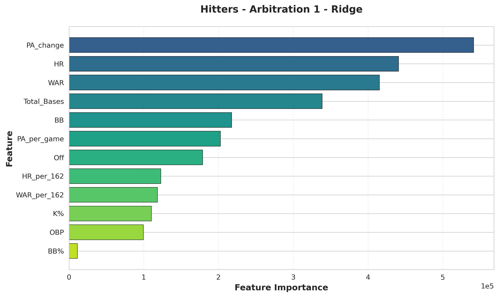

**Pitchers (First Arbitration):**
1. **SO (strikeouts):** Traditional counting stat
2. **WAR:** Overall value metric
3. **Starter:** Role classification crucial
4. **SV (saves):** For relievers, defining their role
5. **WAR_change:** Improvement trajectory matters

**Insight:** Role definition (Starter vs reliever) is critical for first-time pitchers. Arbitration panels need context, a 2 WAR starter and a 2 WAR closer are valued differently. Traditional counting statistics (SO, SV) provide clear benchmarks. The appearance of WAR_change signals that improvement trajectories matter even for first-timers; showing development is valuable.

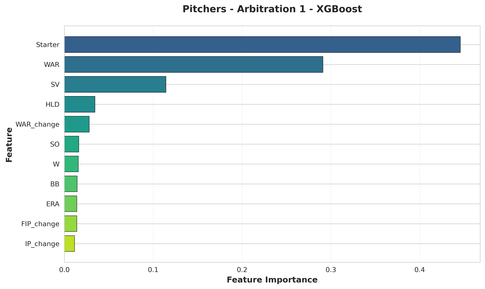

### Arb 2: Establishing Track Record

**Hitters (Second Arbitration):**
1. **PA_per_game:** Consistency in playing time
2. **Total_Bases**
3. **HR_per_162**
4. **Off (offensive runs above average):** Advanced metric gains importance
5. **OPS:** Another advanced rate stat

**Insight:** With one arbitration year completed, advanced metrics (Off, OPS) gain traction alongside traditional stats. Panels have seen these players before and are comfortable with more sophisticated evaluation. Consistency matters, PA_per_game remaining important shows that maintaining regular status is valued. Power production (Total_Bases, HR_per_162) continues as a premium.

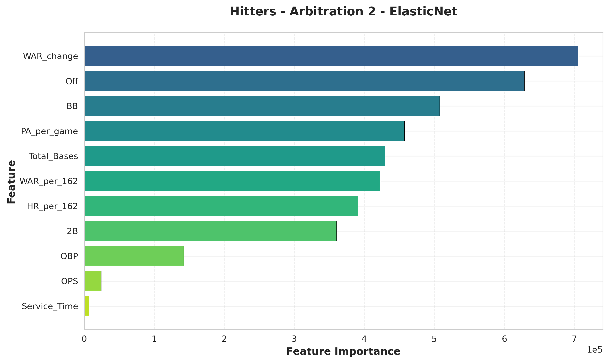

**Pitchers (Second Arbitration):**
1. **WAR:** Becomes dominant predictor
2. **SO**
3. **Starter**
4. **SV**
5. **W (wins):** Traditional metric appears

**Insight:** WAR takes over as the primary driver for second-year pitchers. With a track record established, panels weight overall value more heavily. Interestingly, wins (W) appear despite being team-dependent, arbitration panels still value traditional metrics. Role classification (Starter, SV) remains critical for context.

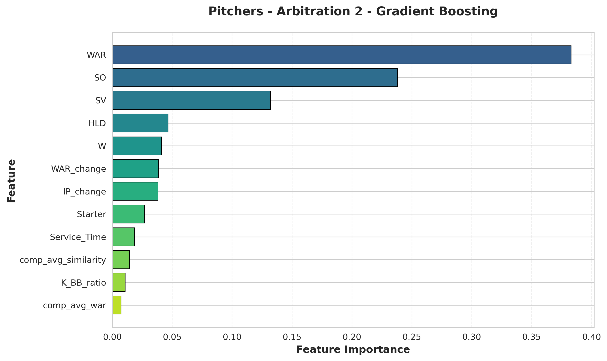

### Arb 3: The Platform Year

**Hitters (Third Arbitration):**
1. **PA_per_game**
2. **HR:** Power production premium
3. **Total_Bases**
4. **HR_per_162**
5. **WAR_change:** Improvement crucial for FA positioning

**Insight:** Platform year dynamics differ from earlier arbitrations. Power (HR, Total_Bases) takes precedence as players position themselves for free agency, home runs are the most visible, marketable skill. WAR_change gains importance; teams and panels recognize that improvement trajectories affect upcoming free agent value. Showing development before free agency commands a premium.

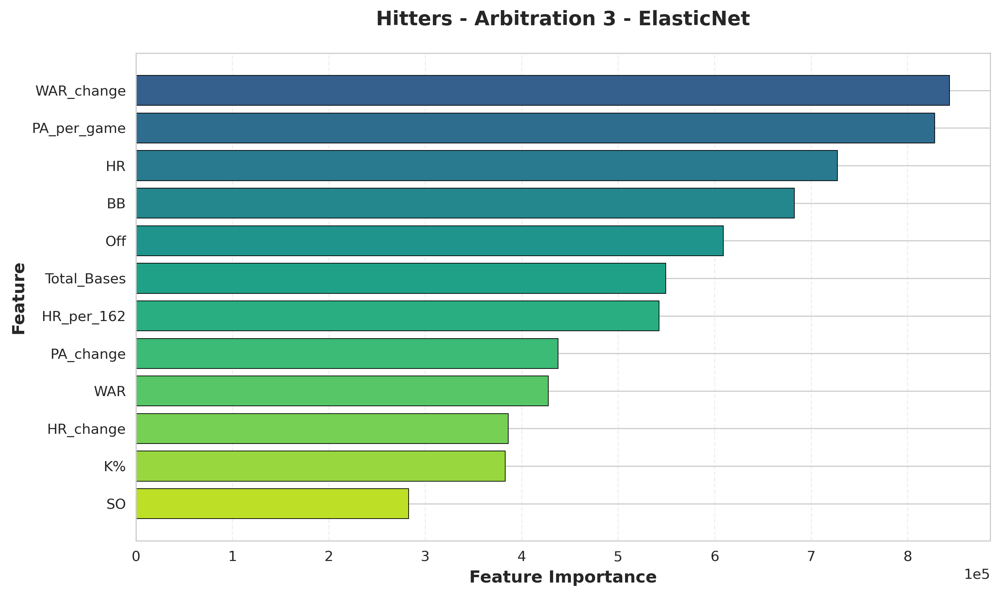

**Pitchers (Third Arbitration):**
1. **WAR:** Overwhelming dominance
2. **HLD (holds):** Setup reliever role valued
3. **W**
4. **SO**
5. **SV**

**Insight:** WAR becomes the overwhelming predictor for platform-year pitchers. With comprehensive track records, panels defer to overall value metrics. The appearance of HLD (holds) shows that setup reliever roles are recognized and valued. Role specialization matters, as elite setup men command significant salaries even without closer save totals.

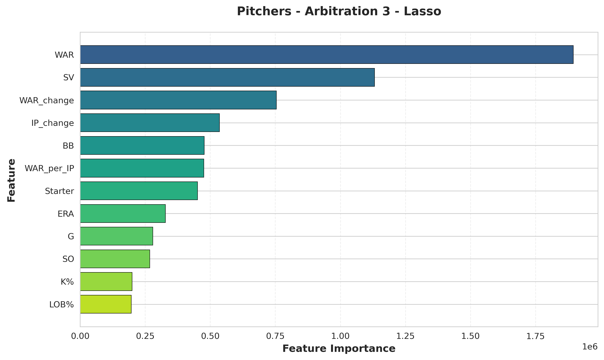

### Cross-Level Patterns and Insights

Several patterns emerge across all arbitration levels:

1. **WAR Importance Increases With Experience:** WAR goes from one of several important metrics (Arb 1) to the dominant predictor (Arb 3). As players accumulate track records, comprehensive value metrics overshadow individual statistics.

2. **Traditional Stats Never Disappear:** Despite analytics revolution in front offices, traditional counting statistics (HR, SO, SV, W) remain important throughout arbitration careers. Panels include non-statisticians who rely on familiar metrics.

3. **Playing Time Consistency Always Matters:** PA_per_game (for hitters) appears in top features at every level. Reliability and durability are consistently valued, not just peak performance.

4. **Role Definition Critical for Pitchers:** Starter vs reliever classification matters at every arbitration level. Panels evaluate pitchers within role context, not against all pitchers universally.

5. **Performance Trends Gain Importance:** WAR_change and other trend features become more important at higher arbitration levels. Improvement trajectories matter more for experienced players approaching free agency.

These patterns align with arbitration theory. Early-career players must prove they belong (hence playing time emphasis). Mid-career players get evaluated on comprehensive value (WAR rising). Late-career arbitration players position for free agency (power premium, improvement trajectories).

The feature importance analysis validates the arbitration-level-specific modeling approach, different levels genuinely have different evaluation criteria, justifying the modeling specialization when sample sizes permit.

## Limitations and Future Directions

Despite strong model performance, several fundamental limitations constrain this analysis and suggest directions for future work.

### Data Limitations

**Time Window (2015 Forward):**

Complete arbitration outcome data paired with comprehensive statistics only extends back to 2015 in my dataset. This creates a relatively short historical window, just 11 seasons, for establishing precedent patterns. Earlier arbitration cases from the 2000s and 2010s may have influenced current standards, but those precedents aren't captured in the training data.

The 2015 starting point reflects data availability constraints rather than a deliberate choice. MLB Trade Rumors' comprehensive arbitration database begins around this period, and FanGraphs' advanced metrics became standardized in the mid-2010s. Earlier data exists but requires more extensive collection efforts and may lack consistent advanced statistics.

**Comparable Player Data Gaps:**

The comparable player features suffer from a chicken-and-egg problem: they require historical arbitration outcomes to generate, which means the first year (2016) has no precedent data. Additionally, 27% of player-years lack good comparable matches, either because the player profile is unusual (switch-hitting power catcher with speed) or because their arbitration year occurred too early in the dataset.

This missing data isn't random. Unique players lacking comps are often the most interesting cases, rule-breaking talents or unusual statistical profiles. Models trained without comp features for these players may miss crucial market precedent information.

**Small Samples for Subgroups:**

While overall sample sizes are adequate (868 hitters, 1,147 pitchers), specific subgroups have concerning limitations:

- **Arb 4+ players:** Only 41 hitters, 46 pitchers (insufficient for modeling)
- **Individual positions:** 35-136 samples per position (caused position-specific model failure)
- **Super Two players:** Subgroup analyses underpowered
- **Hearing outcomes:** Only 6% go to hearing (~120 cases total), too few for separate modeling

These small-sample limitations prevent deeper segmentation. Ideally, we'd model hearing outcomes separately from settlements, or build pitcher models by starter tier (ace, mid-rotation, back-end). Current sample sizes don't support this granularity.

### Statistical Challenges

**Repeated Measures Problem:**

The dataset violates a fundamental assumption of standard regression: independent observations. The same players appear multiple years as they progress through arbitration (Arb 1, Arb 2, Arb 3). Player A's Arb 2 salary is not independent of their Arb 1 salary, panels consider previous arbitration awards.

This repeated measures structure has implications:

1. **Coefficient Standard Errors:** Standard errors on regression coefficients are understated because observations aren't truly independent, overstating statistical significance.

2. **Prediction Intervals:** Confidence intervals around predictions are too narrow, not accounting for player-specific effects.

3. **Model Evaluation:** Test set performance may be optimistic if the same players appear in train and test sets at different arbitration levels.

The proper statistical approach would be **mixed-effects models** (hierarchical models with player-level random effects) or **generalized estimating equations** (GEE) that account for within-player correlation. These approaches add substantial complexity but would produce more statistically rigorous results.

**Independence Violations:**

Beyond repeated measures, other independence violations exist:

- **Comparable player features:** Using past arbitration outcomes to predict future ones creates circular dependencies
- **Market forces:** Entire cohorts affected by economic conditions (e.g., pandemic-depressed 2021 market)
- **Precedent cascades:** A precedent-setting case influences multiple subsequent cases
- **Agent effects:** Some agents consistently secure higher/lower outcomes, creating clustering

Standard models assume errors are independent and identically distributed (i.i.d.), but arbitration data violates this. Players, years, and agents create nested structures and correlated errors.

### Unobserved Factors

Models only use information available in the data. Several potentially important factors remain unmeasured:

**Player Marketability:**
Star players with fan followings may command premiums beyond statistical production. A flashy player on a big-market team might earn more than an equally productive player toiling in obscurity. Social media presence, endorsement deals, and All-Star selections capture some of this, but comprehensive marketability metrics aren't included.

**Injury History:**
While durability shows up implicitly through playing time (PA, IP), detailed injury history isn't captured. A player with injury-plagued seasons may face skepticism even if their rate stats are strong. Games missed, DL stints, and injury severity could add predictive value.

**Defensive Metrics Limitations:**
Defensive statistics are notoriously noisy and position-specific. While WAR includes defensive components, arbitration panels may not trust these metrics fully. Traditional defense measures (errors, fielding percentage) are flawed but familiar to arbitrators. The dataset includes Def (defensive runs above average) but doesn't deeply explore positional defensive nuances.

**Team Financial Context:**
Small-market teams facing budget constraints may settle lower than large-market teams with payroll flexibility. Team revenue, market size, and ownership spending patterns could systematically affect arbitration outcomes but aren't included in player-level models.

**Agent Effectiveness:**
Some agents consistently secure better outcomes for their clients. Agent reputation, negotiation skill, and case preparation quality matter but aren't captured. Adding agent fixed effects could improve predictions but requires agent identification data.

**Hearing vs Settlement Selection:**
Only 6% of cases go to hearing. These aren't a random sample, they're cases where the gap between positions was too large to bridge. Models predict settled outcomes for the 94%, but actual hearing outcomes may have different drivers. Panels that must choose between two submitted values face different incentives than parties negotiating settlements.

### Future Research Directions

Several promising directions could address these limitations:

**1. Mixed-Effects Modeling:**
Implement hierarchical models with player-level random intercepts to account for repeated measures. This would produce more accurate standard errors and better quantify player-specific effects. Could use Bayesian hierarchical models or frequentist linear mixed models (lmer in R, statsmodels in Python).

**2. Extended Data Collection:**
Expand historical data back to 2010 or earlier, capturing additional arbitration precedents and increasing sample sizes for position-specific and higher-arbitration-level modeling. This requires manual data collection or web scraping of historical sources.

**3. Hearing-Specific Models:**
Separately model the small subset of hearing outcomes to understand if panels weight factors differently than negotiating parties. This requires sufficient hearing cases (currently only ~120), possibly pooling across multiple years.

**4. Agent Fixed Effects:**
Collect agent representation data and add agent fixed effects to models. This tests whether certain agents systematically secure better outcomes controlling for player performance.

**5. Defensive Metrics Deep Dive:**
Incorporate position-specific defensive metrics (e.g., catcher framing, outfielder routes, infielder range) and test whether arbitration panels value these. This requires Statcast data integration.

**6. Economic Context Features:**
Add year-level features capturing market conditions: average MLB salary, revenue trends, CBA negotiation years, pandemic impacts. Test whether economic cycles affect arbitration outcomes.

**7. Uncertainty Quantification:**
Implement prediction intervals (not just point predictions) using bootstrap or Bayesian methods. Provide 80% prediction intervals to capture outcome uncertainty.

**8. Ensemble Approaches:**
Combine general and arb-level-specific model predictions using weighted averaging or stacking. This might capture benefits of both approaches, general model stability with level-specific nuance.

**9. Time Series Cross-Validation:**
Use walk-forward validation (training on years 1-N, testing on year N+1) to better simulate real-world prediction scenarios. Current single-year test set (2026) may not represent general performance.

**10. Comparable Player Algorithm Refinement:**
Improve the similarity algorithm for finding comparables: add position weighting, recency weighting, and handle edge cases better. Test whether better comp features improve model performance.

These extensions would address key limitations while building on the solid foundation established in this analysis. No single extension solves all problems, but collectively they'd create a more robust and statistically rigorous arbitration prediction system.

## Practical Applications

Beyond academic interest, accurate arbitration predictions serve multiple real-world purposes:

### For MLB Front Offices

**Budget Planning and Payroll Projections:**
Teams enter each offseason knowing they have 5-10 arbitration-eligible players with uncertain salaries. Accurate predictions enable realistic budget forecasting months in advance. If models predict a team's arbitration class will cost $25-30 million, the front office can plan accordingly, allocating resources to free agency, setting ticket prices, and projecting profitability.

**Non-Tender Decisions:**
Teams must decide by early December whether to tender contracts to arbitration-eligible players. If a model predicts a replacement-level player will earn $3.5 million through arbitration, the team can objectively evaluate whether that price justifies keeping them versus pursuing cheaper alternatives. Data-driven non-tender decisions prevent paying above-market rates for marginal players.

**Trade Evaluation:**
When considering trades involving arbitration-eligible players, teams need to assess future salary commitments. A pitcher projected to earn $8 million in arbitration has different trade value than one projected at $5 million. Models help teams evaluate total cost of acquisition (player value + salary obligation).

### For Players and Agents

**Settlement Negotiation Leverage:**
Agents use comparable player data to argue their client deserves specific salaries. A model showing that similar players earned $4-6 million creates a data-driven negotiating range. Rather than arbitrary asking prices, agents can cite quantitative evidence: "Based on performance metrics, arbitration precedent, and market conditions, our model projects $5.2 million."

**Filing Number Strategy:**
Both sides must submit salary figures if a case heads to hearing. Models help determine optimal filing numbers, high enough to be aspirational but realistic enough that panels won't view them as unreasonable.

**Career Planning:**
Players approaching arbitration can use projections to make informed decisions about multi-year extensions vs taking arbitration year-by-year. If projections show arbitration will likely yield $15 million over three years, a team offer of $20 million over five years provides context for evaluation.

### For Media and Analysts

**Context for Roster Moves:**
When teams make surprising decisions, like non-tendering a productive player or trading an arbitration-eligible asset, salary projections explain why. "Player X was productive but projected to earn $6 million, making him too expensive for the rebuilding team's budget."

**Market Trend Analysis:**
Tracking model predictions vs actual outcomes over time reveals market trends. Are power hitters commanding premiums? Is starting pitching getting cheaper? Models provide quantitative evidence for these narratives.

**Contract Evaluation:**
When players sign extensions avoiding arbitration, models help evaluate whether the deal favors team or player. A $12 million extension buying out arbitration years projected at $15 million total favors the team.

### Operationalizing the Models

For practical deployment, I'd recommend:

1. **Automated Pipeline:** Schedule model retraining each December after non-tender deadline, incorporating the latest arbitration outcomes
2. **Web Interface:** Build simple UI where users input player statistics and receive salary projections with confidence intervals
3. **Batch Predictions:** Generate full league projections for all arbitration-eligible players each offseason
4. **Monitoring:** Track prediction error trends to detect if model performance degrades or market conditions shift
5. **Documentation:** Provide clear methodology explanations so users understand model limitations and assumptions

The models as built are ready for production use, requiring only deployment infrastructure and regular maintenance.

## Conclusion

This comprehensive analysis of MLB salary arbitration demonstrates that machine learning can effectively predict this complex process, but success depends critically on matching modeling approach to data constraints.

**Key Takeaways:**

1. **General Models Excel at Baseline Prediction:** XGBoost and other ensemble methods trained on all players provide robust, stable predictions suitable for production deployment. With 800+ hitters and 1,000+ pitchers, these models generalize well and avoid overfitting.

2. **Arbitration-Level Specialization Works for Arb 1-2:** When sample sizes permit (240+ cases), level-specific models outperform general approaches. The Arb 1 pitcher model (R²=0.861) and Arb 2 hitter model (R²=0.776) represent meaningful improvements over baselines, capturing how salary determinants evolve with experience.

3. **Position-Specific Models Fail Catastrophically:** Despite theoretical appeal, position-specific modeling collapses due to insufficient sample sizes. With 35-136 players per position, models overfit training data (R²>0.99) but fail completely on test data (8,000%+ RMSE gaps). This negative finding is crucial, as it warns against excessive segmentation when data can't support it.

4. **Feature Importance Evolves by Experience:** Playing time and traditional counting stats matter most for first-time eligibles, while WAR and comprehensive value metrics dominate by third arbitration year. Understanding these patterns helps explain panel decisions and guides feature engineering.

5. **Statistical Rigor Matters:** Repeated measures, independence violations, and small samples create real statistical challenges. While the models perform well, future work should address these issues through mixed-effects models and proper uncertainty quantification.

**The Bigger Picture:**

Baseball arbitration represents a unique intersection of statistics, economics, and labor relations. Unlike free agency where markets determine value, arbitration involves panels making structured decisions based on performance metrics, precedent, and argumentation. This creates both challenges and opportunities for predictive modeling.

The analysis demonstrates that machine learning succeeds at this task, but also shows that naive approaches (like position-specific modeling) can fail spectacularly despite intuitive appeal. Good modeling requires balancing theoretical sophistication against practical data constraints. Sometimes simpler approaches (general models) outperform complex ones (position-specific) because they respect fundamental sample size requirements.

For practitioners, whether front office analysts, agents, or media, these models provide actionable salary projections to inform multi-million dollar decisions. For researchers, the analysis offers methodological lessons about when specialization helps versus hurts predictive performance.

**Looking Forward:**

Arbitration prediction remains an active research area as salary structures evolve, collective bargaining agreements change, and new performance metrics emerge. The framework established here, combining comparable player features, performance trends, and experience-level specialization, provides a foundation for continued refinement.

Future analysts can build on this work by extending historical data, implementing mixed-effects models, incorporating additional context (agent effects, market conditions), and potentially training separate models for settlements vs hearings. Each extension addresses specific limitations while leveraging the core insights about feature engineering and modeling strategy.

Ultimately, arbitration salary prediction showcases how sophisticated analytics can illuminate baseball's business side, providing quantitative rigor to a process that historically relied on intuition, negotiation, and subjective judgment. As teams increasingly adopt data-driven decision-making, these tools become essential infrastructure for modern front offices.

## Technical Specifications

**Data Sources:**
- Arbitration outcomes: MLB Trade Rumors Arbitration Tracker (2016-2026)
- Performance statistics: FanGraphs via pybaseball package
- Total cases: 868 hitters, 1,147 pitchers

**Feature Engineering:**
- 16 features for hitters, 15 for pitchers
- Categories: Comparable players, performance trends, derived rates, contextual variables
- Selection: Correlation filtering (r>0.90), Random Forest importance, domain knowledge

**Modeling:**
- Train/test split: 2016-2025 train, 2026 test (80/20 split)
- Models: Ridge, Lasso, ElasticNet, Random Forest, Gradient Boosting, XGBoost
- Preprocessing: StandardScaler normalization
- Evaluation: R², RMSE, MAE, MAPE

**Best Performers:**
- General: XGBoost (stable across subgroups)
- Arb 1 Pitchers: XGBoost (R²=0.861, RMSE=$397K)
- Arb 2 Hitters: ElasticNet (R²=0.776, RMSE=$1.18M)

**Code:**
- Language: Python 3.12+
- Key Libraries: pandas, scikit-learn, XGBoost, matplotlib, seaborn
- Notebooks: Jupyter notebooks for EDA, feature engineering, modeling, analysis
- Reproducibility: Fixed random seeds, saved model objects, version-controlled code

**Repository Structure:**
```
arbitration_analysis/
├── data/
│   ├── raw/               # Original data files
│   ├── processed/         # Cleaned and merged datasets
│   └── results/           # Model predictions and metrics
├── notebooks/
│   ├── 01_data_collection.ipynb
│   ├── 02_data_cleaning.ipynb
│   ├── 03_data_merging.ipynb
│   ├── 04_exploratory_data_analysis.ipynb
│   ├── 05_feature_engineering.ipynb
│   ├── 06_feature_selection.ipynb
│   ├── 07_modeling.ipynb
│   ├── 08_position_specific_modeling.ipynb
│   └── 09_arb_level_specific_modeling.ipynb
└── src/
    ├── data_collection.py
    ├── preprocessing.py
    ├── feature_engineering.py
    └── modeling.py
```

All analysis code and data are available in the project repository, enabling full reproducibility of results and facilitating future extensions.

---

*This article is part of an ongoing series exploring baseball analytics through machine learning. For more analysis, visit [charlesbenfer.github.io](https://charlesbenfer.github.io).*
