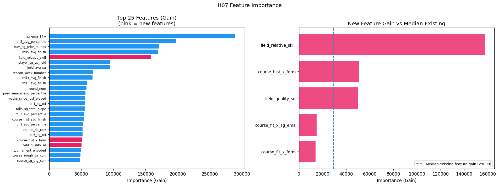

## The Setup

My [previous post](https://charlesbenfer.github.io/2026-03-02-pga-tour-prediction-system/) described a four-model XGBoost system for predicting PGA Tour outcomes: one classifier each for made cut, top 20, top 10, and a regressor for percentile finish. Trained on 2015–2022 data, validated on 2023, tested on 2024–2025. The system achieved a **top-20 AUC of 0.730**, improved Precision@10 to **37.1%** across early 2026 events, and wrapped everything in a Monte Carlo simulation layer and a Streamlit betting dashboard with live Bovada odds.

That post ended with a note: *"The regressor is where the most headroom remains."*

What followed was a seven-notebook experiment designed to test whether a fundamentally different modeling approach — hierarchical mixed-effects boosting — could squeeze meaningful gains out of the same underlying data. The short answer is that it couldn't. The longer answer is more interesting: the experiment revealed *why* the baseline is so hard to beat, identified one genuine improvement worth deploying, and produced a clear null result that tells you something important about what strokes-gained statistics actually measure.

---

## Why Hierarchical Models Seemed Promising

The existing model treats every player-tournament row as independent. That's obviously not quite right. The same player appears across dozens of tournaments — some of their performance variance is consistent, player-specific skill that the SG features don't fully capture. Different courses introduce their own difficulty effects. And within a single tournament, a player's round scores are correlated: a player who shoots 65 on Thursday is probably better than their SG average suggests, not just lucky.

The statistical framework for modeling this is called a **partially linear mixed model**:

```
y = f(X) + b_player + b_tournament + ε
```

where `f(X)` is what any gradient-boosted tree computes, and `b_player`, `b_tournament` are random effects — player- and venue-specific adjustments that shrink toward zero when data is sparse and grow when evidence is strong.

The theoretical gain: better predictions for players with limited histories (fewer SG rounds, new to a course), and better-calibrated uncertainty through the random effect variance components.

Three implementations were tested, plus a simulation redesign and a feature engineering pass. Here's what each found.

---

## The Experimental Framework

All work lives in a `hierarchical_testing/` subdirectory with seven numbered notebooks. The data pipeline starts with **H01**, which restructures the existing tournament-level data into a player-round format — melting the wide R1–R4 columns into long format, giving roughly 4× more training rows (~181,000 player-rounds vs. ~45,000 player-tournaments). The new target variable is `sg_vs_field`: strokes gained relative to the field average for that specific round. Higher is better.

New round-level features were added: `round_num` (1–4), `after_cut` (binary — R1/R2 vs. R3/R4), `cum_sg_prior_rounds` (running SG total within the current tournament), and `rounds_played_in_tourn`. The temporal split stayed the same: train ≤ 2022, val = 2023, test = 2024–2025.

One data quality note worth flagging: several features from the raw statistics CSV had object dtype despite containing numeric values. A `pd.to_numeric(errors='coerce')` pass in H01 was necessary before any LightGBM training would proceed — tree models aren't forgiving about dtype mismatches.

---

## Method 1: Round-Level LightGBM Baseline (H02)

Before testing anything hierarchical, a sensible baseline was needed: the same LightGBM model architecture applied to the round-level data, predicting `sg_vs_field` with no random effects at all.

The simulation layer converts round-level predictions into tournament outcome probabilities. For each of 5,000 Monte Carlo simulations per field: draw four round scores from a Student-t(df=7) distribution centered at the model's prediction with scale σ = residual standard deviation, apply the cut rule (top 65 + ties after R2), rank total score. Win probability = fraction of simulations where a player finishes first.

**Results on the 2024–2025 test set (95 tournaments):**

| Metric | Value |
|--------|-------|
| Test RMSE | 2.906 strokes/round |
| Within-tournament Spearman ρ | 0.209 ± 0.096 |
| Made Cut Brier improvement vs. existing | +0.3% |
| Top 20 Brier improvement | +2.4% |
| Top 10 Brier improvement | +2.3% |
| Win Brier improvement | +1.3% |

The per-round Spearman ρ breakdown reveals something important: R1 (0.229) and R2 (0.222) are substantially stronger than R3 (0.153) and R4 (0.157). Weekend rounds are only observed for made-cut players — a non-random subset — which compresses the range of outcomes and makes ranking harder. The `after_cut` flag partially addresses this but doesn't eliminate the selection bias.

Top features by SHAP: `sg_ema_14w` (14-week exponentially weighted SG), `player_sg_vs_field`, `cum_sg_prior_rounds`, `round_num`, and `field_avg_sg`. The within-tournament cumulative SG feature ended up fourth overall — suggesting that within-tournament momentum is genuinely predictive, not just noise.

This baseline became the benchmark every subsequent method had to beat. None of them did, consistently.

---

## Method 2: Alternating Optimization with Player and Tournament Random Effects (H03)

The first hierarchical approach implements a `AlternatingGBMixedModel` that iterates between two steps:

1. **Tree step**: Fit LightGBM on partial residuals (target minus current random effect estimates)
2. **Random effect step**: Update player and tournament effects via posterior-mean shrinkage

The shrinkage formula for each player effect is:

```
b_i = (n_i * ȳ_i) / (n_i + σ²_ε / σ²_player)
```

where `n_i` is the number of rounds for player i, `ȳ_i` is their mean residual, and the ratio `σ²_ε / σ²_player` controls how aggressively sparse players are pulled toward zero. Players with few rounds get heavily shrunk; players with hundreds of rounds get their residual mean back nearly unchanged.

The variance components σ²_player and σ²_tournament are updated via method of moments at each iteration.

**The result was a complete null:**

| Component | Value |
|-----------|-------|
| σ²_player | 0.000001 |
| σ²_tournament | 0.000001 |
| σ²_error | 7.75 |
| ICC (intraclass correlation) | ≈ 0.000 |

The alternating optimizer converged in four iterations. The player effect delta dropped to 0.000002. All three model variants — tree only, tree + player RE, full model with both REs — produced **identical RMSE (2.902) and identical within-tournament ρ (0.211)**.

What does ICC ≈ 0 mean? Once you condition on the SG features and rolling form metrics, there is essentially no residual between-player variance left. The model already knows who the good players are. Adding a random effect for player identity — which is what the SG features already encode — contributes nothing.

This is, counterintuitively, a positive finding about the existing feature engineering. The strokes-gained statistics and rolling form metrics are capturing player skill so comprehensively that explicit random effects are redundant. The variance that remains (σ²_error = 7.75) is round-to-round noise, and that's genuinely irreducible.

---

## Method 3: GPBoost and NGBoost (H04)

### GPBoost

GPBoost implements joint likelihood optimization via Laplace approximation — theoretically more principled than the alternating approach, since it co-optimizes the tree and random effects simultaneously rather than cycling between them.

In practice it hit the same wall. The grouped random effects for player and tournament IDs found the same near-zero ICC as H03. GPBoost RMSE was **2.927** and within-tournament ρ was **0.177** — both worse than the H02 baseline. Two undocumented API constraints also added friction: `set_prediction_data()` must be called before training with a validation set (not after), and bagging is incompatible with joint GP optimization.

### NGBoost

NGBoost takes a different angle: instead of predicting a single `sg_vs_field` value, it fits the full conditional distribution p(y \| X) as a Normal(μ, σ²), training separate gradient-boosted trees for the mean and the log-variance. The distributional output is the unique value proposition — player-round-specific uncertainty estimates that the other models can't provide.

After three rounds of fixes (StandardScaler before fit, max_depth=3 for the base learner, hard clipping of predicted σ to [0.3, 6.0] strokes), NGBoost RMSE was **2.904** — essentially tied with H02. The numerical instability issue is fundamental to the model's architecture: σ = exp(tree_output) is unbounded, and tree models extrapolate badly on out-of-distribution feature combinations. `cum_sg_prior_rounds` was the likely culprit for experienced players in weekend rounds, where the cumulative total can reach values far outside the training distribution.

---

## The Key Structural Finding

At this point the experiment had produced a clear pattern: every method that tried to add hierarchical structure on top of the tree found nothing to model. The tree was already there.

The right question to ask after H01–H04 wasn't *which hierarchical architecture works better*, but *if the mean model is saturated, what else could move the needle?*

Two candidates emerged: (1) the **simulation layer itself**, which was using a fixed noise level for all players in all rounds, and (2) **variance heterogeneity** — some players and courses are simply more predictable than others.

---

## Method 4: Simulation V2 — Day-Level Shared Shocks and Heteroskedastic Variance (H06)

The V1 simulation draws independent Student-t noise for every player in every round. This assumes that Scottie Scheffler's score on Sunday is statistically independent of Rory McIlroy's score on Sunday, at the same course, in the same weather, playing the same pins. That's obviously wrong — all players in a round share the same environmental conditions.

The updated simulation architecture adds two components:

```
score_ij = μ_ij  +  δ_j  +  ε_ij

δ_j ~ N(0, σ²_day)          shared shock for all players on round-day j
ε_ij ~ Student-t(ν, σ_ij)   player-specific idiosyncratic noise
σ_ij = exp(var_model(X) / 2) heteroskedastic variance from a secondary LGB model
```

The variance model was trained on `log(residual²)` from the H02 model using 2023 validation data — out-of-sample residuals from the mean model — then evaluated on 2024–2025.

**Day-level ICC from 2023 validation residuals:**

| Component | Value |
|-----------|-------|
| σ_day | 0.186 strokes |
| Day-level ICC | 0.004 (0.4% of residual variance) |

The day-level shared component is real but very small. Within-day correlation in sg_vs_field is nearly zero because the target is already relative to the field average — when conditions are bad for everyone, the field average moves with it, and sg_vs_field stays approximately centered.

**Variance model performance:** Spearman ρ between predicted σ and actual |residual| = 0.058. Statistically significant (p < 10⁻⁸⁰) but weak in practical terms.

The critical calibration issue: training `log(residual²)` with MSE loss estimates E[log(residual²)], which by Jensen's inequality corresponds to the geometric mean of |residual|, not the RMS. The geometric mean is systematically below the RMS when the residual distribution is right-skewed. Without calibration, the simulation ran with σ ≈ 1.5 strokes average versus the true noise of 2.9 strokes — producing win probabilities that were grotesquely overconfident (effective field size dropped from 67.5 to 35.0).

After adding a calibration factor `k = RMSE_val / sqrt(mean(σ²_pred_val))`, the effective field size snapped back to 67.3 — matching V1 exactly. Brier scores after calibration:

| Outcome | Existing | V1 (H02) | V2 Calibrated |
|---------|---------|---------|--------------|
| Made Cut | 0.2161 | 0.2155 | 0.2154 |
| Top 20 | 0.1244 | 0.1214 | 0.1217 |
| Top 10 | 0.0708 | 0.0692 | 0.0694 |
| Win | 0.0080 | 0.0079 | 0.0079 |

Calibrated V2 is statistically indistinguishable from V1. The variance model has ρ = 0.058 — enough signal that every player gets a slightly different σ — but not enough to change simulation outcomes. The fixed-σ simulation was already doing the right thing in aggregate.

---

## Method 5: Field Strength and Course-Fit Interactions (H07)

The final experiment added five engineered features to the H02 mean model:

- **`field_relative_skill`**: Player's `SG_Total_Avg` minus the mean `SG_Total_Avg` of all players in the field. Captures how dominant a player is relative to *this specific field*, not just the tour-wide average.
- **`field_quality_sd`**: SD of `SG_Total_Avg` across the field. Measures field depth — how competitive the top players are versus the field overall.
- **`course_fit_x_form`**: `course_fit_sg_score × roll5_avg_percentile`. Interaction between course SG signature fit and recent form percentile.
- **`course_fit_x_sg_ema`**: `course_fit_sg_score × sg_ema_14w`. Same interaction with a different form measure.
- **`course_hist_x_form`**: `course_hist_avg_finish × roll5_avg_percentile`. Course history × current form.

The correlations with `sg_vs_field` on training data were statistically significant for four of five:

| Feature | Spearman ρ | p-value |
|---------|-----------|---------|
| `field_relative_skill` | +0.122 | < 10⁻³⁰⁰ |
| `course_fit_x_form` | +0.091 | 1.9 × 10⁻²²² |
| `course_fit_x_sg_ema` | +0.076 | 6.4 × 10⁻¹⁵⁴ |
| `course_hist_x_form` | +0.046 | 4.1 × 10⁻⁵⁸ |
| `field_quality_sd` | +0.002 | 0.56 |

`field_quality_sd` is genuinely null (p = 0.56); drop it permanently.

The other four have real signal. But after retraining, the model performed *worse*:

| Model | Val RMSE | Test RMSE | Within-ρ |
|-------|---------|---------|----------|
| H02 baseline | 2.872 | 2.906 | 0.209 |
| H07 (+ new features) | 2.876 | 2.908 | 0.202 |

The culprit is different for each feature group:

**`field_relative_skill` (rank 5 by gain, but harmful):** `field_relative_skill = SG_Total_Avg - field_quality_mean`. The tree assigned it to rank 5 and `player_sg_vs_field` to rank 6 — nearly identical importance. These two features are measuring the same quantity through different paths. The tree spent its capacity splitting between two correlated features instead of deepening on either, and the result is overfitting.

**Course-fit interactions (ranks 85–86):** `course_fit_sg_score` is null for **50.3%** of player-tournament pairs — first-time players at a venue, or newer courses with insufficient history. Filling nulls with zero turns the interaction feature into a mixture: half the rows are exactly zero (no information), half carry the actual interaction. The tree approximates the non-null half using `course_fit_sg_score` and the form features independently, and the explicit product adds nothing.

**`course_hist_x_form` (rank 21):** `course_hist_avg_finish` has 44.3% nulls with the same masking problem. The signal is there when the feature is non-null, but there isn't enough of it to move aggregate RMSE.

The feature importance chart makes the situation vivid: `field_relative_skill` dwarfs every other new feature in gain, yet the model gets worse.



---

## Full Experiment Summary

| Method | Test RMSE | Within-ρ | Made Cut Brier | Top 20 Brier | Top 10 Brier | Win Brier |
|--------|---------|---------|--------------|------------|------------|---------|
| Existing XGBoost | — | — | 0.2161 | 0.1244 | 0.0708 | 0.0080 |
| H02: Round LGB (no RE) | 2.906 | 0.209 | 0.2155 | 0.1214 | 0.0692 | 0.0079 |
| H03: Alternating RE | 2.902 | 0.211 | ≈ H02 | ≈ H02 | ≈ H02 | ≈ H02 |
| GPBoost | 2.927 | 0.177 | — | — | — | — |
| NGBoost | 2.904 | 0.205 | — | — | — | — |
| H06: V2 Simulation (calibrated) | — | — | 0.2154 | 0.1217 | 0.0694 | 0.0079 |
| H07: + Field + Interactions | 2.908 | 0.202 | — | — | — | — |

---

## What Goes to Production

**H02 — round-level LightGBM with V1 simulation** — is the model that will replace the existing XGBoost system. The improvements are real and consistent:

- **+2.4% Brier on Top 20**, **+2.3% on Top 10** over the existing tournament-level XGBoost
- Made Cut and Win improvements are smaller (+0.3%, +1.3%) but directionally positive
- The simulation naturally handles the cut structure and produces win/top5/top10/top20/made-cut probabilities from a single model rather than four separate classifiers

The round-level framing is also a better fit for the problem: 181,000 player-rounds give the model roughly 4× more data than the tournament-level format, and within-tournament momentum features (`cum_sg_prior_rounds`) become legitimate predictors rather than look-ahead leakage.

The simulation stays fixed-σ (V1). The variance model (H06) found Spearman ρ = 0.058 between predicted and actual |residual| — too weak to change outcomes. Calibration is essential but the signal isn't there to make heteroskedasticity useful.

---

## What the Null Results Tell You

The most informative result of the entire experiment wasn't a model that worked — it was the ICC ≈ 0 finding in H03.

The intraclass correlation coefficient measures what fraction of total variance lies between players rather than within players. In theory, a good golf prediction model should leave substantial between-player residual variance — a "skill residual" for things the features couldn't capture. ICC ≈ 0 means there is no such residual. The strokes-gained statistics, rolling form features, and course history have absorbed essentially all the player-identity signal.

This is a statement about what SG statistics are: they're not just performance summaries, they're near-sufficient statistics for predicting future performance conditional on course and field. Adding player identity as an explicit random effect gives the model nothing it doesn't already have.

The same logic explains why `field_relative_skill` hurt the H07 model despite a genuine training-set correlation of ρ = 0.122: `player_sg_vs_field` already encodes what `field_relative_skill` is trying to say. You can't trick a tree model with a redundant feature — it just splits its capacity between two correlated signals instead of one, and generalization suffers.

---

## Where the Ceiling Is and How to Raise It

The experiment converged on a consistent picture of the irreducible noise floor in golf prediction. Within-tournament Spearman ρ = 0.209 — the model explains roughly 4% of the variance in round-by-round strokes gained relative to field. The literature on sports prediction suggests the theoretical ceiling for within-tournament ρ in golf is around 0.30–0.35, implying roughly 30–35% of variance is attributable to consistent player skill rather than round-to-round noise.

The gap between 0.209 and 0.30 is real. But it won't be closed by model architecture changes — H03 through H07 demonstrated that comprehensively. The remaining signal lives in data the current system doesn't have:

**Official world rankings per field.** A player's OWGR rank within the specific field they're entering is a cleaner measure of relative strength than SG averages, and avoids the collinearity that sank `field_relative_skill`. OWGR is public data.

**Course architectural features.** The course SG signature approach (computing Pearson correlations between SG components and finish position) is a proxy for what actual course specifications would provide: green size, rough height, fairway width, yardage by hole. These are available from course rating organizations and would enable true course-player fit modeling rather than correlation-based approximations.

**Tee time assignments.** Morning and afternoon wave scoring often differs by 2–4 strokes on a single day due to wind and course setup changes. This is the real mechanism behind the day-level shared shock the H06 simulation was trying to model. The variance was too small to detect from scores alone (ICC = 0.004), but if tee time groups were explicitly encoded as features, the day-level correlation structure would be directly modelable.

Until then, H02 is the right production model — and the null results from H03 through H07 provide clean evidence for *why*.

---

*The full experiment is documented in notebooks H01–H07 in the `hierarchical_testing/` directory. The production model is `hierarchical_testing/data/lgbm_round_model.pkl` with simulation code in `predict_week.py`. The codebase is at [https://github.com/charlesbenfer/PGA_Prediction_Tools](https://github.com/charlesbenfer/PGA_Prediction_Tools).*
